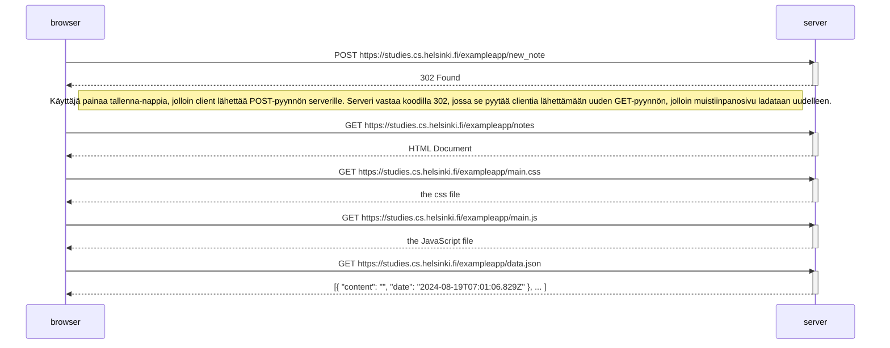

```mermaid
sequenceDiagram
    participant browser
    participant server
    
    browser->>server: POST https://studies.cs.helsinki.fi/exampleapp/new_note
    activate server
    server-->>browser: 302 Found
    deactivate server

    Note right of browser: Käyttäjä painaa tallenna-nappia, jolloin client lähettää POST-pyynnön serverille. Serveri vastaa koodilla 302, jossa se pyytää clientia lähettämään uuden GET-pyynnön, jolloin muistiinpanosivu ladataan uudelleen.
    
    browser->>server: GET https://studies.cs.helsinki.fi/exampleapp/notes
    activate server
    server-->>browser: HTML Document
    deactivate server
        
    browser->>server: GET https://studies.cs.helsinki.fi/exampleapp/main.css
    activate server
    server-->>browser: the css file
    deactivate server

    browser->>server: GET https://studies.cs.helsinki.fi/exampleapp/main.js
    activate server
    server-->>browser: the JavaScript file
    deactivate server
    
    browser->>server: GET https://studies.cs.helsinki.fi/exampleapp/data.json
    activate server
    server-->>browser: [{ "content": "", "date": "2024-08-19T07:01:06.829Z" }, ... ]
    deactivate server 

```
