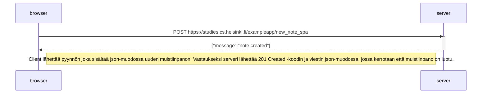

```mermaid
sequenceDiagram
    participant browser
    participant server
    
    browser->>server: POST https://studies.cs.helsinki.fi/exampleapp/new_note_spa
    activate server
    server-->>browser: {"message":"note created"}
    deactivate server

    Note right of browser: Client lähettää pyynnön joka sisältää json-muodossa uuden muistiinpanon. Vastaukseksi serveri lähettää 201 Created -koodin ja viestin json-muodossa, jossa kerrotaan että muistiinpano on luotu.

```